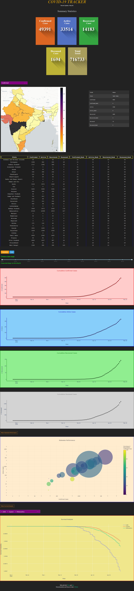

# Covid-19 Dashboard
#### Update in Progress
## Introduction

The Covid-19-India-Tracker dashboard tracks the metrics and trends of the Covid-19 pandemic for the country of India. It is bulit using Python, Dash and Plotly using the dataset made available in [Kaggle Covid-19-In-India](https://www.kaggle.com/sudalairajkumar/covid19-in-india "Covid-19-In-India"). The dashboard is deployed as a web app using Heroku and is live at https://app-rob-trial.herokuapp.com.

The various sections of the dashboard are explained below. Before that, this is how the entire dashboard look like.

***

### Summary Statistics

The dashboard begins with the section that displays certain summary statistics, calculated upto the time the dashboard was updated. All of the numbers are only for the country of India.

* Confirmed Cases :  Cumulative number of cases confirmed positive with the covid-19 virus.
* Recovered Cases :  Cumulative number of cases recovered successfully after treatment.
* Deceased Cases&nbsp; :  Cumulative number of cases deceased.
* Active Cases&nbsp; &nbsp; &nbsp; &nbsp; : Cumulative number of cases currently active and undergoing treatment. 
  * `Confirmed Cases - (Recovered Cases + Deceased Cases)`
* Total Tested&nbsp; &nbsp; &nbsp; &nbsp;: Cumulative number of samples tested for the covid-19 virus.

These will further be referred to as metrics.

***

### Virus Spread across India

The statewise distribution of the different metrics mentioned in the previous section is visualised in a map of India. The type of cases namely _Confirmed, Active, Recovered and Deceased_ can be selected using the _dropdown_ provided. The states are given a color based on the number of cases which is represented in the colorbar present on the right. When _hovering over the states_, a table appears in the right which gives additional details about the state including the ranking of the state compared to other states.

The plot can be zoomed and moved using basic touchpad features. Moreover, plotly provides various features like zoom, select etc which are present on the top right side of every plot.

***

### Data Table

A table is provided with the details of all the states of India. An additional information is the ranking provided for states based on the cases. The columns can be sorted to get a better view of the data.

***

### Metrics Trend 

This section gives a visual representation of the metrics for the country as a whole. The mode of visualisation can be toggled between Cumulative and Daily using the _buttons_ provided. The _date slider_ can be used to view in on the trend of the metrics for a specific date range. By default, the date is set to the date of the first observed case to the last updated date. The date range chosen will be displayed below for your reference. There are four plots that follow which shows the trend for each metric separately.

This is my first shot at making a dashboard as well as working with front end technologies. If you would like to point out any mistakes or if you have any queries or suggestions, please feel free to reach out to me [here](https://www.linkedin.com/in/robnix16pd30 "Linkedin").
